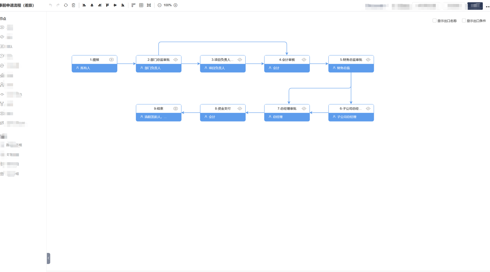
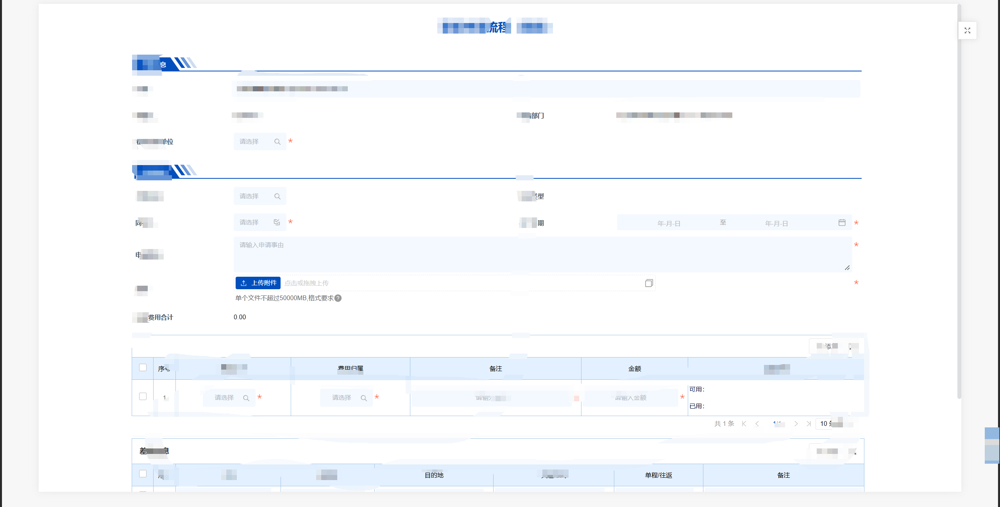
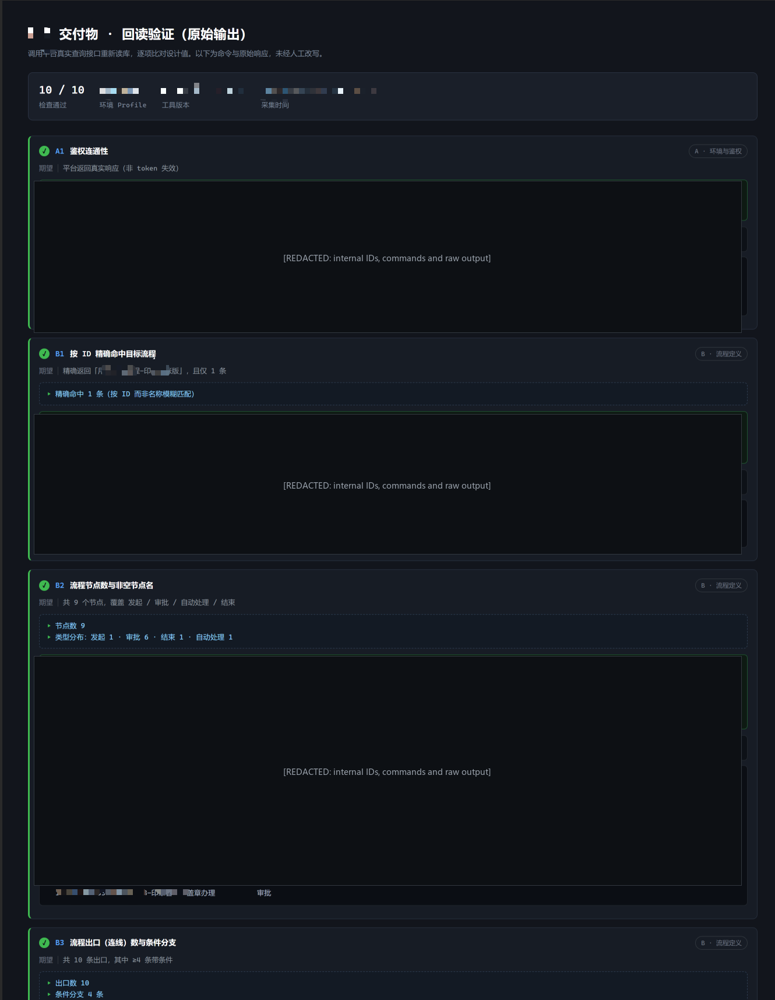

# AI-Assisted Enterprise Workflow Delivery

An AI-assisted delivery toolkit and anonymized case study for enterprise low-code workflows.

This repository documents how a complex implementation project was converted into a repeatable workflow:

```text
capability boundaries
-> configuration planning
-> batch implementation
-> structured readback
-> evidence collection
-> handover
```

## Project Snapshot

| Area | Result |
|---|---:|
| Business modules | 4 |
| Native workflows | 22 |
| Main forms | 22 |
| Detail forms | 13 |
| Workflow nodes | 138 |
| Workflow connections | 137 |
| Conditional branches | 37 |
| Formulas | 15 |
| Field groups | 71 |

## Case Study

- [AI-Assisted Enterprise Workflow Delivery](docs/enterprise-workflow-delivery-case-study.md)

The case study covers:

- Converting requirements into executable configuration plans
- Form, field, group, workflow, permission, and formula configuration
- Readback-based verification
- Six recurring delivery problems and their resolutions
- A structured verification suite covering authentication, workflow, form, data, and action-flow checks

## Evidence

### Workflow



### Form



### Readback Verification



## Core Principle

> A successful command response is not evidence of a successful configuration. The actual state must be read back and verified.

## Public Disclosure

This repository contains no client identity, contracts, commercial terms, internal prices, private network information, credentials, production data, personnel names, or proprietary source code.

Internal IDs, commands, environment addresses, and raw validation output are redacted from all public evidence.

## License

MIT
